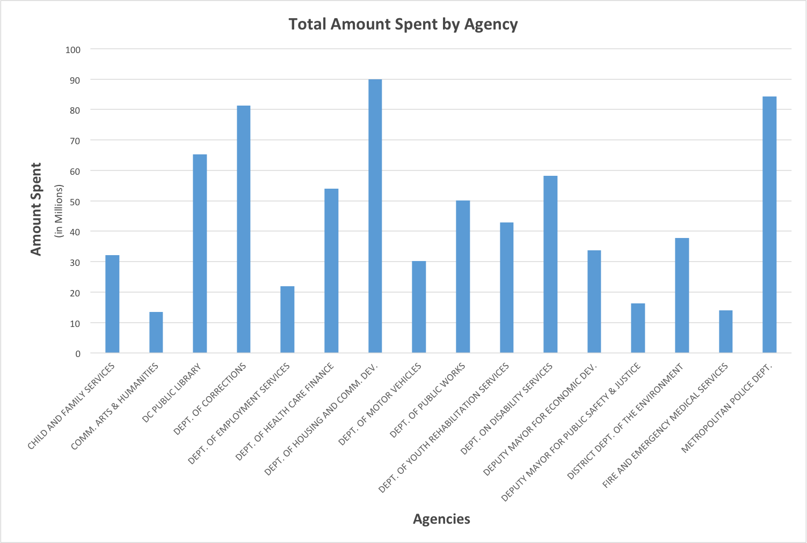
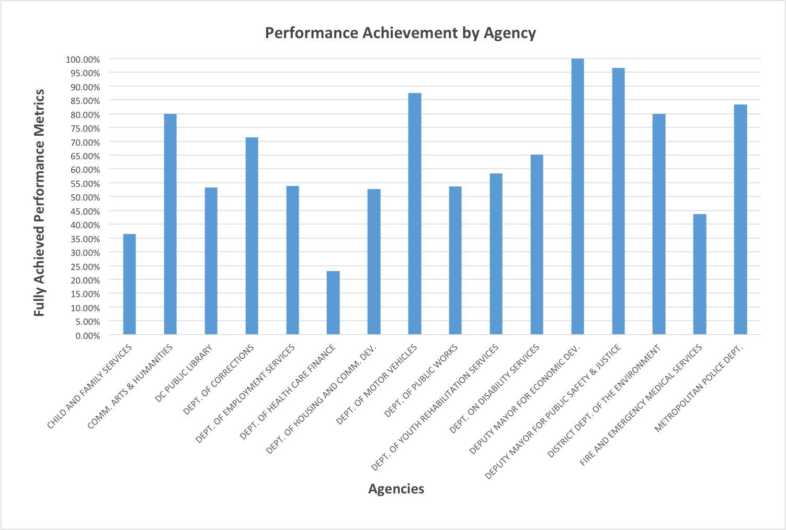
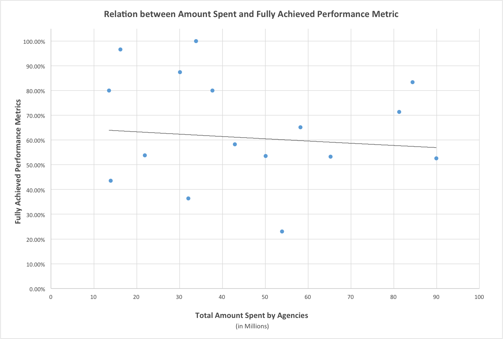

#DC KPI and PO DB
A Combination of DC Purchase Order and Performance Metrics Data

-----------
Version 1.0
-----------

Version 1.0 (2015)

-------------------
Description of Data
-------------------
The Washington, DC municipal government posts a great number of datasets to their Open Data ([http://opendata.dc.gov/](http://opendata.dc.gov/)) site. From it, we selected two datasets to combine via MariaDB to aid in their analysis. The first dataset contained all of the purchase orders from 2013 totalling over $2500 (District of Columbia Open Data, 2013a). The second contained various key performance indicators for the various DC government agencies (District of Columbia Open Data, 2013b).Both datasets are organized by agency, by which we could link the two.

---------------------
Why Combine the Data?
---------------------
By combining these datasets, we hoped to establish whether or not any correlation exists between the total purchase orders of a particular agency and their performance metrics performance, i.e., does money spent equal performance gains?

-------------
Data Analysis
-------------
For analysis of the data present in the two datasets, we combined the two datasets on basis of the common variable named ‘Agency’. We then tried to analyze if there is any relationship between the total amount spent (P.O.Totals) by an agency and the percentage of “Fully Achieved” performance rating. We first calculated the percentage of "Fully Achieved" performance rating in with respect to the total performance rating amongst categories including "Fully Achieved, Partially Achieved, and Not Achieved." A new excel sheet was then created containing the name of agency, the total amount spent by agency and the percentage of “Fully Achieved” performance rating. Histograms for each of the variables was the plotted using the R instruction: hist (sample$P.O..Totals) and hist (sample$Percentages).
	
Descriptive Analysis: We used the command ‘summary ()’ in R to determine the descriptive analysis and ‘hist ()’ to plot the histogram.
Commands: summary(sample$P.O..Totals) ; summary(sample$Fully.Achieved.Percentages)
For the variable: P.O.Totals: Mean = 68420000; Median = 15090000
For the variable: Fully Achieved Percentages: Mean= 53.09; Median = 51.80

In order to then determine the relation between the amount spent by an agency and the performance rating achieved by an agency, we then used a scatter plot for both variables using the R command: ‘plot(sample$P.O..Totals, sample$Fully.Achieved.Percentages)’. The figures are as below:

Figure 1. Histogram of total amount spent.

Figure 2. Histogram of fully achieved performances.

Figure 3. Relation between amount spent and performance metric.

As seen in figure three, there is no direct correlation between the total amount spent by an agency and the percentage of the “Fully Achieved Performances” in accordance to the overall performance metrics. According to the graph, some agencies do show higher percentage of “Fully Achieved” performances when the amount spent is greater than the previous agency, however this trend is not consistent for all agencies and hence we can conclude a particular correlation.

----------
References
----------
District of Columbia Open Data. (2013a). DC Agency Performance Data (KPI’s) - 2013 [Data set]. Retrieved from [http://opendata.dc.gov/datasets/aab8213fd7de4e548ffecdd4820815a3_0?uiTab=table&orderByFields=Rating+DESC](http://opendata.dc.gov/datasets/aab8213fd7de4e548ffecdd4820815a3_0?uiTab=table&orderByFields=Rating+DESC) Access date: March 17, 2016

District of Columbia Open Data. (2013b). DC Purchase Orders - 2013 [Data set]. Retrieved from [http://opendata.dc.gov/datasets/abc00ed761234b8387ddaeb4e759fc70_0?orderByFields=Agency+ASC](http://opendata.dc.gov/datasets/abc00ed761234b8387ddaeb4e759fc70_0?orderByFields=Agency+ASC) Access date: March 17, 2016

-----------
 DCKPIandPODB by <a xmlns:cc="http://creativecommons.org/ns#" href="https://github.com/cedporter/dckpiandpodb" property="cc:attributionName" rel="cc:attributionURL">C. Edward Porter / Utkarsha Devkar</a> is licensed under a <a rel="license" href="http://creativecommons.org/licenses/by/4.0/">Creative Commons Attribution 4.0 International License</a>. Based on a work at <a xmlns:dct="http://purl.org/dc/terms/" href="http://opendata.dc.gov/" rel="dct:source">http://opendata.dc.gov/</a>.

